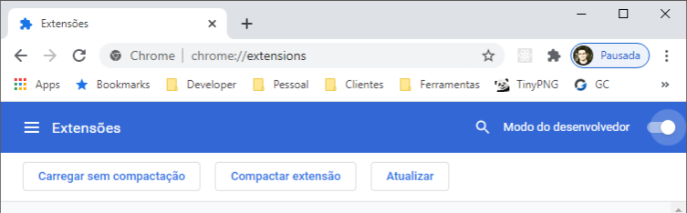
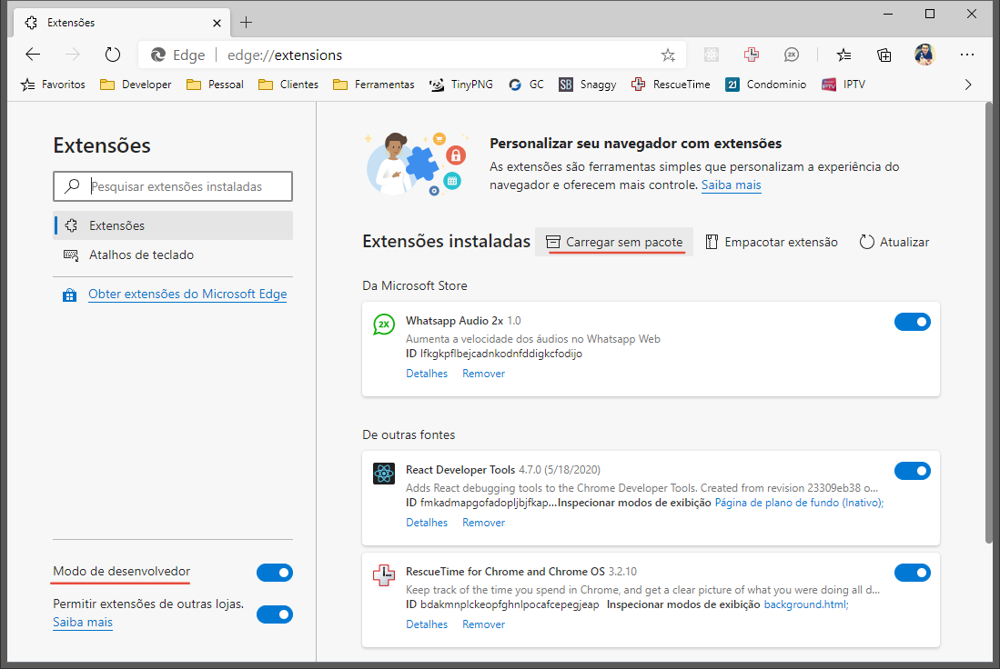

# TimeClock

## Extension to browsers Chromium based

    

> É livre a colaboração nesse projeto.

Inicie clonando o diretório:

    git clone https://github.com/zastrich/WppAudio2x minha-extensao

Você pode carregar sua extensão diretamente no navegador através da pasta "extension" com os arquivos baixados.

### Google Chrome
Acesse [chrome://extensions/](chrome://extensions/) e ative o "Modo do desenvolvedor"

Clique em "Carregar sem compactação" e aponte para a pasta "extension" do projeto.

### Microsoft Edge Chromium
Acesse [edge://extensions/](edge://extensions/) e ative o "Modo de desenvolvedor"

Clique em "Carregar sem pacote" e aponte para a pasta "extension" do projeto.

## Caso queira contribuir recomendamos que mude a versão da extensão no arquivo [extension/manifest.json](./extension/manifest.json)